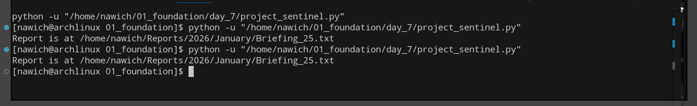

# 🛰️ Project Sentinel: Daily Intelligence Briefing

**Project Sentinel** is a modular Python-based data pipeline that automates the generation of structured intelligence reports. It integrates JSON-based configuration, secure environment validation, and automated filesystem archival.

## 📂 Project Architecture

The system is built on a 4-layer architectural model:

1.  **Configuration Layer (Inputs):** Uses `config.json` to manage areas of interest dynamically, allowing for easy updates without modifying core logic.
2.  **Simulation Engine (Processing):** Employs the `random` module and nested dictionaries to simulate high-fidelity data extraction and confidence scoring.
3.  **Report Designer (Formatting):** Transforms raw data into a human-readable format using advanced f-string manipulation and structured headers.
4.  **Automated Archive (Output):** Leverages `datetime` and `os.path` to generate a dynamic folder hierarchy (`Reports/YYYY/Month/`) for persistent storage.

## 🛠️ Skills Demonstrated
* **Filesystem Automation:** Professional use of `os.makedirs(exist_ok=True)` and `os.path.join` for cross-platform compatibility.
* **Data Transformation:** Converting raw JSON lists into enriched dictionary objects with metadata.
* **Date Manipulation:** Using Python's `datetime` objects to drive automated archival logic.
* **Security Best Practices:** Implementing a "Gatekeeper" logic to simulate `.env` permission checks.

## 🚀 Usage
1.  **Configure:** Add your topics to `day_7/config.json`.
2.  **Authenticate:** Ensure your environment permission is set (simulated).
3.  **Run:**
    ```bash
    python project_sentinel.py
    ```
4.  **View:** Your report will be available at `/home/nawich/Reports/[Year]/[Month]/Briefing_[Day].txt`.

## 📄 Sample Report Output
```text
--- DAILY INTELLIGENCE REPORT: 2026-01-25 ---

[ARCH LINUX]
Headline: The Future Scope of Arch Linux
Confidence Score: 0.942
--------------------

SUMMARY: Total articles found: 3

